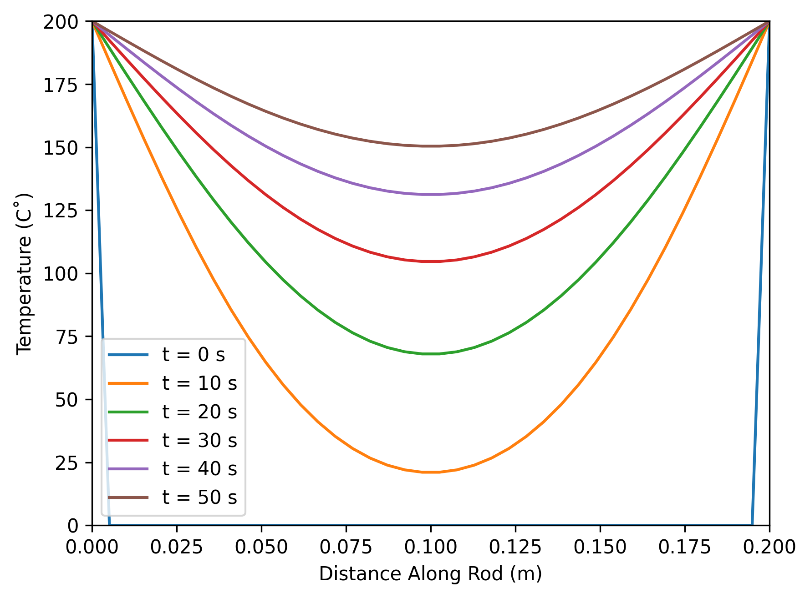
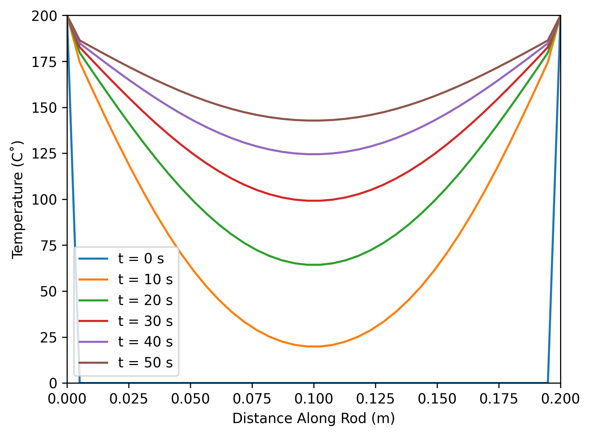
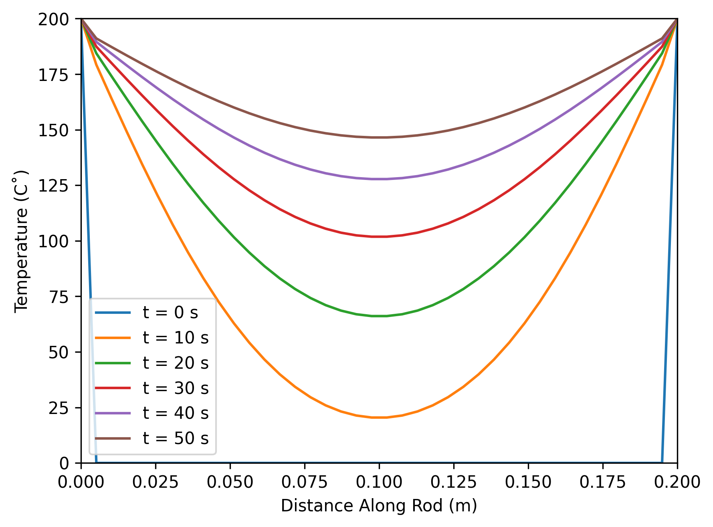
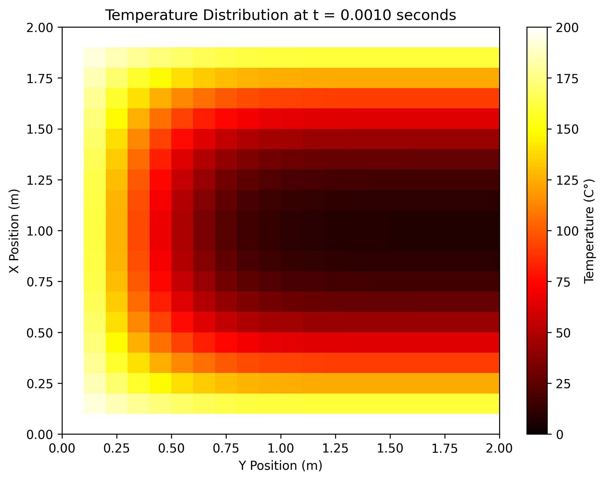
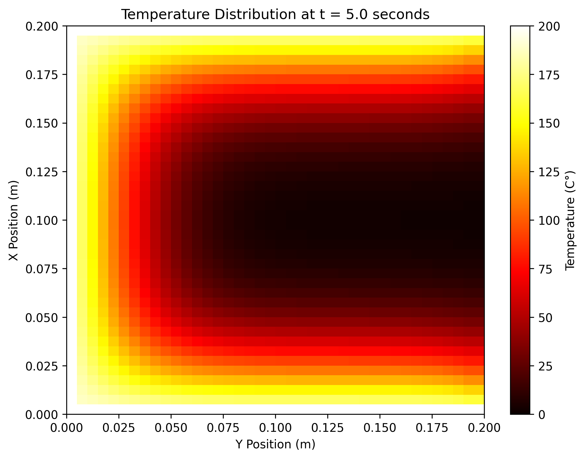
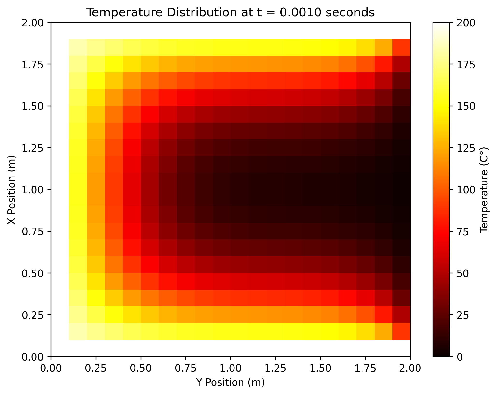

# Numerical Solutions to the 1D and 2D Heat Equation Using Explicit, Implicit, and Crank-Nicolson Methods

## Abstract
This paper explores the numerical solutions to the one-dimensional and two-dimensional heat equations using three different finite difference methods: explicit, implicit, and Crank-Nicolson methods. The explicit method, while computationally simple, has strict stability constraints. The implicit method and Crank-Nicolson method, on the other hand, are unconditionally stable and provide better accuracy, especially for larger time steps.However, they are more computational expensive. I also provide graphical comparisons of the performance and accuracy of each method for both 1D and 2D cases.

## I. Introduction
The heat equation is a partial differential equation that describes the distribution of heat in a given region over time. It is widely used in physics and engineering, particularly in the modeling of heat conduction in solid materials. The numerical solutions of the heat equation are essential when analytical solutions are difficult or impossible to obtain due to complex geometries or boundary conditions. In this paper, I present three common finite difference methods to solve the 1D and 2D heat equations numerically.

The three methods are: the explicit method, which is simple to implement but conditionally stable; the implicit method, which is unconditionally stable but computationally more expensive; and the Crank-Nicolson method, which is also unconditionally stable and offers higher accuracy.

## II. Heat Equation in 1D

The one-dimensional heat equation is given by:
$$
\frac{\partial u}{\partial t} = k \frac{\partial^2 u}{\partial x^2}
$$
where \( u(x, t) \) is the temperature at position \( x \) and time \( t \), and \( k \) is the thermal diffusivity constant.

### A. Explicit Method
In the explicit method, the finite difference approximation for the time derivative is:
$$
\frac{\partial u}{\partial t} 
= 
\frac{u^{n + 1}_{i} - u^{n}_{i}}{\Delta t}
$$
The spatial derivative is approximated using central differences as:
$$
k \frac{\partial^2 u}{\partial x^2} = k \frac{u^{n}_{i + 1} - 2u^{n}_{i} + u ^{n}_{i - 1}}{(\Delta x)^2}
$$
Substituting into the original equation, I get:
$$
u^{n + 1}_{i} = u^{n}_{i} + r (u^{n}_{i + 1} - 2 u^{n}_{i} + u^{n}_{i - 1})
$$
where \( r = \frac{k \Delta t}{(\Delta x)^2} \). To ensure stability, the **CFL condition** must be satisfied:
$$
r \leq \frac{1}{2}
$$

### B. Implicit Method
In the implicit method, the finite difference approximation at time step \( n+1 \) is used for the spatial derivatives. This leads to the following system of equations:
$$
-ku^{n + 1}_{i - 1} + (1 + 2r)u^{n + 1}_{i} - ku^{n + 1}_{i + 1} = u^{n}_{i}
$$
This system can be written in matrix form as:
$$
A u^{n+1} = u^n
$$
where \( A \) is a tridiagonal matrix. This method is unconditionally stable and can be efficiently solved using the Thomas algorithm.

### C. Crank-Nicolson Method
The Crank-Nicolson method is a semi-implicit method that averages the explicit and implicit schemes, providing second-order accuracy. The discretization is:
$$
\frac{u^{n + 1}_{i} - u^{n}_{i}}{\Delta t} 
= 
\frac{1}{2}k 
\frac{(u^{n + 1}_{i + 1} - 2u^{n + 1}_{i} + u ^{n + 1}_{i - 1}) + (u^{n}_{i + 1} - 2u^{n}_{i} + u ^{n}_{i - 1})}{(\Delta x)^2}
$$
This can be written as:
$$
A_1 u^{n+1} = A_2 u^n
$$
where \( A_1 \) and \( A_2 \) are tridiagonal matrices. This method is also unconditionally stable and provides better accuracy than the implicit method.

## III. Heat Equation in 2D

The two-dimensional heat equation is given by:
$$
\frac{\partial u}{\partial t} = k \left( \frac{\partial^2 u}{\partial x^2} + \frac{\partial^2 u}{\partial y^2} \right)
$$

### A. Explicit Method
The explicit method for the 2D heat equation involves applying forward differences for the time derivative and central differences for the spatial derivatives in both directions:
$$
u_{i,j}^{n+1} = u_{i,j}^n + r_x (u_{i+1,j}^n - 2 u_{i,j}^n + u_{i-1,j}^n) + r_y (u_{i,j+1}^n - 2 u_{i,j}^n + u_{i,j-1}^n)
$$
where $ r_x = \frac{k \Delta t}{(\Delta x)^2} $ and $ r_y = \frac{k \Delta t}{(\Delta y)^2} $. The stability condition is:
$$
r_x + r_y \leq \frac{1}{2}
$$

### B. Implicit Method
For the implicit method, the finite difference approximations are applied at time step \( n+1 \):
$$
\frac{u_{i,j}^{n+1} - u_{i,j}^n}{\Delta t} = k \left( \frac{u_{i+1,j}^{n+1} - 2 u_{i,j}^{n+1} + u_{i-1,j}^{n+1}}{(\Delta x)^2} + \frac{u_{i,j+1}^{n+1} - 2 u_{i,j}^{n+1} + u_{i,j-1}^{n+1}}{(\Delta y)^2} \right)
$$
This results in a system of linear equations for \( u^{n+1} \), which must be solved at each time step.

### C. Crank-Nicolson Method
The Crank-Nicolson method averages the spatial derivatives at time steps \( n \) and \( n+1 \):
$$
\begin{aligned}
\frac{u_{i,j}^{n+1} - u_{i,j}^n}{\Delta t} = \frac{k}{2} \Bigg( &\frac{u_{i+1,j}^{n+1} - 2 u_{i,j}^{n+1} + u_{i-1,j}^{n+1}}{(\Delta x)^2} + \frac{u_{i,j+1}^{n+1} - 2 u_{i,j}^{n+1} + u_{i,j-1}^{n+1}}{(\Delta y)^2} \\
&+ \frac{u_{i+1,j}^n - 2 u_{i,j}^n + u_{i-1,j}^n}{(\Delta x)^2} + \frac{u_{i,j+1}^n - 2 u_{i,j}^n + u_{i,j-1}^n}{(\Delta y)^2} \Bigg)
\end{aligned}
$$
This can be written as a system of equations and solved iteratively at each time step.

## IV. Results

### A. 1D Heat Equation
The results of the explicit, implicit, and Crank-Nicolson methods for the 1D heat equation are visualized in **Fig. 1**, **Fig. 2**, and **Fig. 3**, respectively. As expected, the Crank-Nicolson method provides the most accurate solution, followed by the implicit method, while the explicit method requires a smaller time step to maintain stability.

#### Fig. 1: Visualization of the 1D heat equation solution using the explicit method.

#### Fig. 2: Visualization of the 1D heat equation solution using the implicit method.

#### Fig. 3: Visualization of the 1D heat equation solution using the Crank-Nicolson method.

### B. 2D Heat Equation
For the 2D heat equation, the results of each method are compared in **Fig. 4**, **Fig. 5**, and **Fig. 6**, respectively. The explicit method demonstrates instability when the CFL condition is violated, whereas the implicit and Crank-Nicolson methods maintain stability for larger time steps.

#### Fig. 4: Visualization of the 2D heat equation solution using the explicit method.

#### Fig. 5: Visualization of the 2D heat equation solution using the implicit method.

#### Fig. 6: Visualization of the 2D heat equation solution using the Crank-Nicolson method.

## V. Conclusion
In this paper, I presented and compared three numerical methods for solving the 1D and 2D heat equations. The explicit method is simple to implement but conditionally stable, while the implicit and Crank-Nicolson methods are unconditionally stable and provide more accurate solutions. The Crank-Nicolson method, in particular, is recommended for scenarios requiring high accuracy, although it is computationally more expensive.

## References
[1]Courant, R.; Friedrichs, K.; Lewy, H., "On the partial difference equations of mathematical physics", *IBM Journal of Research and Development*, 11 (2): 215–234.

[2] Snehashish Chakraverty; Nisha Mahato; Perumandla Karunakar; Tharasi Dilleswar Rao, "Finite Difference Method," in *Advanced Numerical and Semi-Analytical Methods for Differential Equations* , Wiley, 2019, pp.53-62.

[3] Jesse R. Phagan, "Applied Mathematics," 4th ed., *Goodheart-Willcox*, 2010.

[4] D. -X. Zhao and J. -M. Wang, "Exponential stability of a coupled Heat-ODE system," *2013 25th Chinese Control and Decision Conference (CCDC)*, Guiyang, China, 2013, pp. 169-172.

